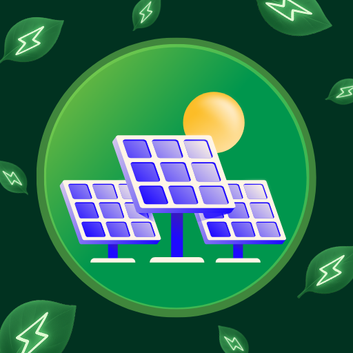

  

# ☀️ SolarScan

**SolarScan** is a smart web app that helps users analyze their electricity bills and discover how much solar power they need to slash their energy costs ⚡  

Built with **React + TypeScript**, **SolarScan** combines clean design with powerful solar analytics — powered by a custom **[SolarScan API backend](https://github.com/MuneebAbro/SolarScan)** for advanced bill parsing and solar recommendations.

---

## 🚀 Features
- 💡 Enter monthly bill data for instant analysis  
- ☀️ Calculate recommended solar kW  
- 📈 View cost breakdowns and potential savings  
- 🔆 Responsive and modern UI powered by Tailwind CSS  
- 🧠 Simple yet intelligent solar estimation logic  

---

## 🛠️ Tech Stack
- **React (Vite)**  
- **TypeScript**  
- **Tailwind CSS**  
- **shadcn/ui**  
- **Chart.js**  

---

## 🎯 Project Goals
- Make solar planning effortless for everyday users  
- Visualize energy costs and savings clearly  
- Promote clean energy awareness through tech  

---

## 👨‍💻 Author
**Muneeb Abro**  
Crafted with ☀️ passion and 💻 caffeine.  

---

## 📜 License
Open source under the [MIT License](LICENSE).
